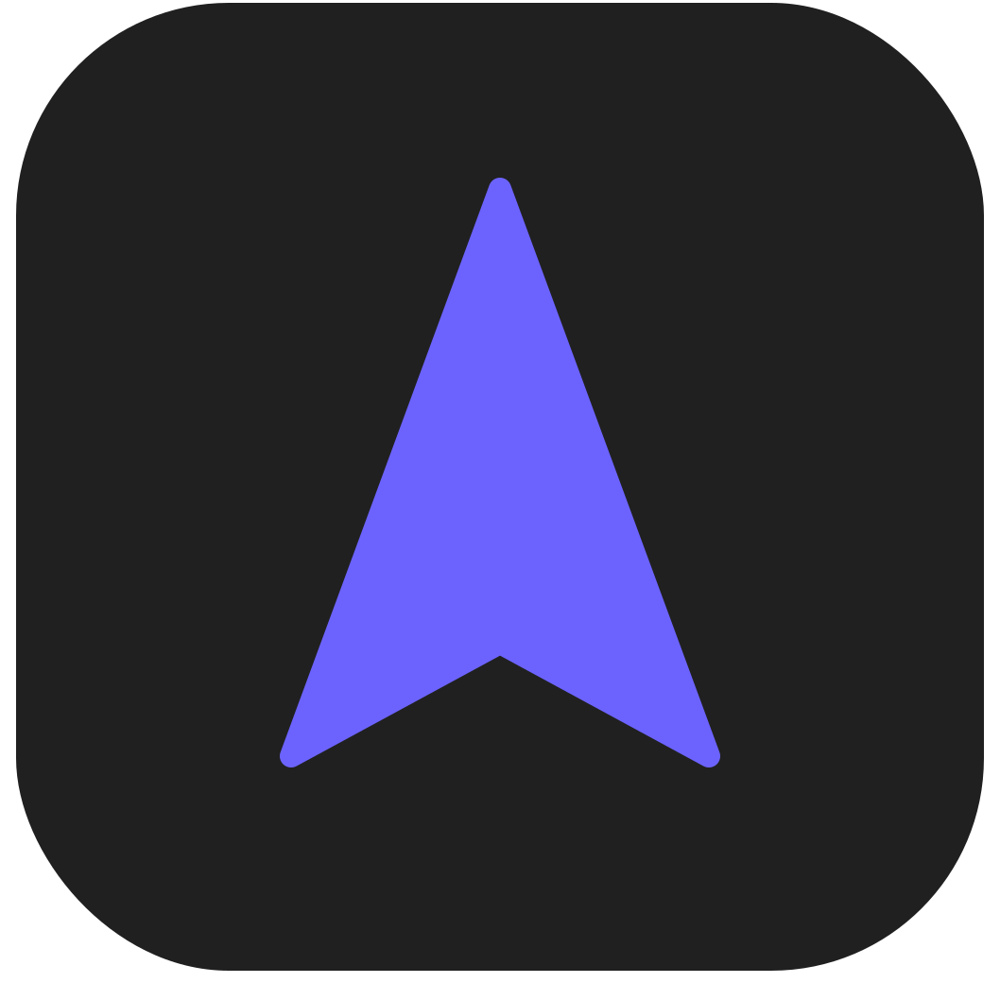

<!--
   - This Source Code Form is subject to the terms of the Mozilla Public
   - License, v. 2.0. If a copy of the MPL was not distributed with this
   - file, You can obtain one at http://mozilla.org/MPL/2.0/.
   -->
<!-- TODO: Get a job -->

### `Vibe Browser`

Vibe is a firefox-based browser with the aim of pushing your productivity to a new level!

  <a href="https://vibe-browser.app/download">
    Download
  </a>
  •
  <a href="https://vibe-browser.app">
    Website
  </a>
  •
  <a href="https://docs.vibe-browser.app">
    Documentation
  </a>
  •
  <a href="https://vibe-browser.app/release-notes/latest">
    Release Notes
  </a>

### Firefox Versions

- [`Release`](https://vibe-browser.app/download) - Is currently built using Firefox version `152.0.3`! 🚀
- [`Twilight`](https://vibe-browser.app/download?twilight) - Is currently built using Firefox version `RC 152.0.3`!

### Contributing

If you'd like to report a bug, please do so on our [GitHub Issues page](https://github.com/vibe-browser/desktop/issues/) and for feature requests, you can use [GitHub Discussions](https://github.com/vibe-browser/desktop/discussions).

Vibe is an open-source project, and we welcome contributions from the community! Please take a look at the [contribution guidelines](./docs/contribute.md) before getting started!

#### Partners

Thanks to all the partners of Vibe for their support and contributions:

